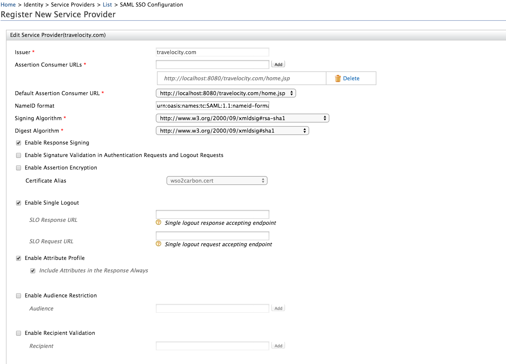
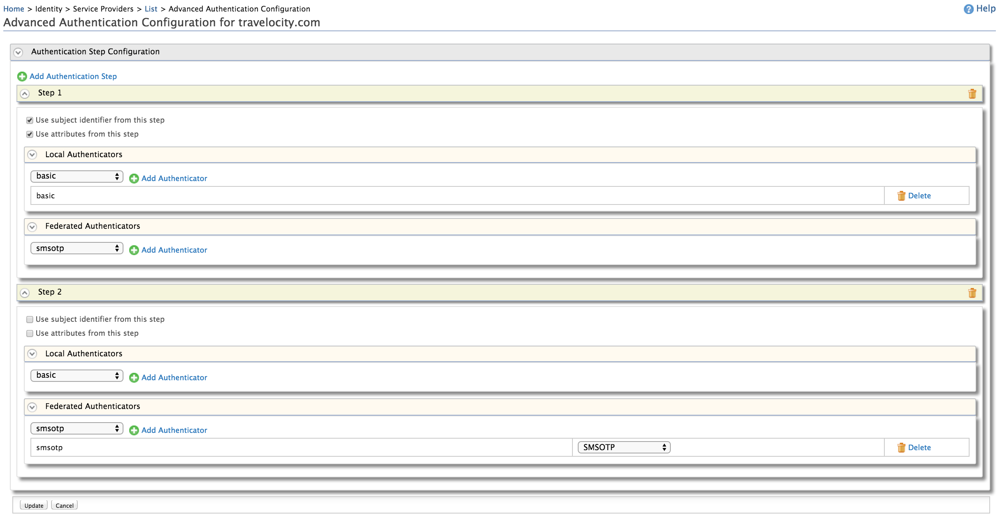
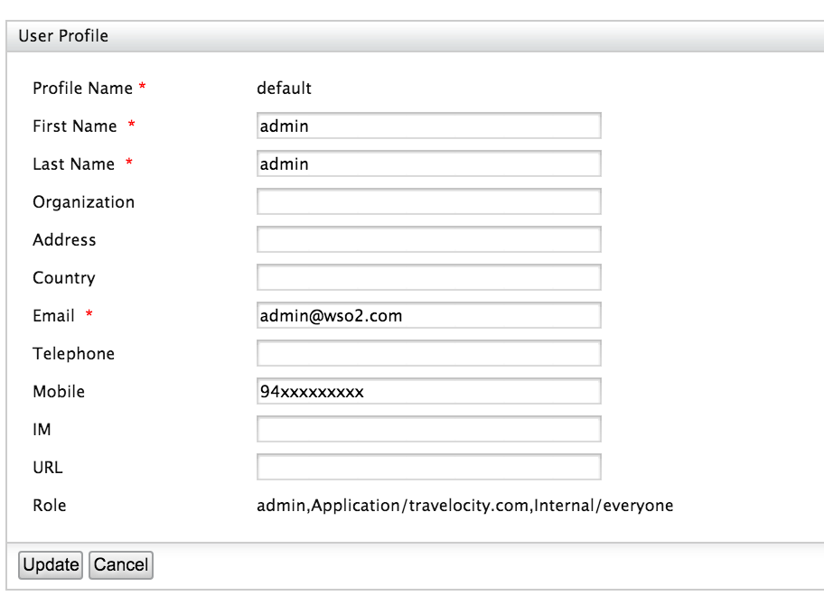
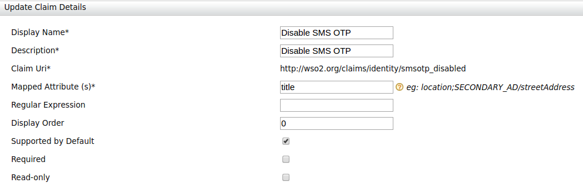
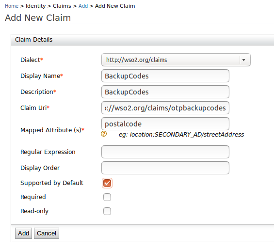
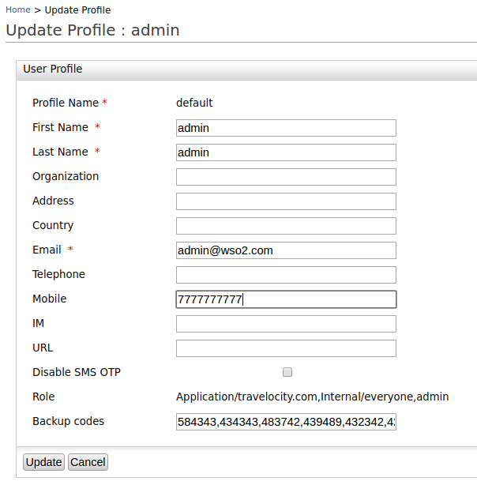
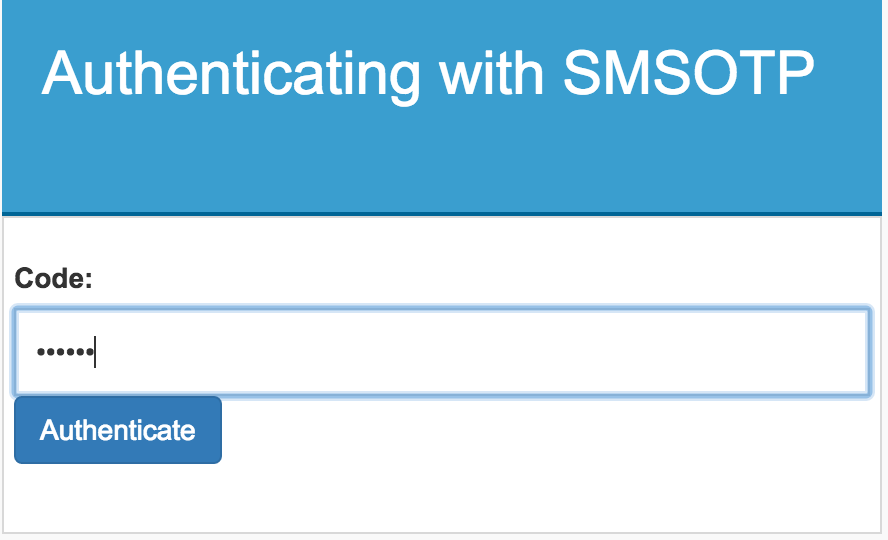
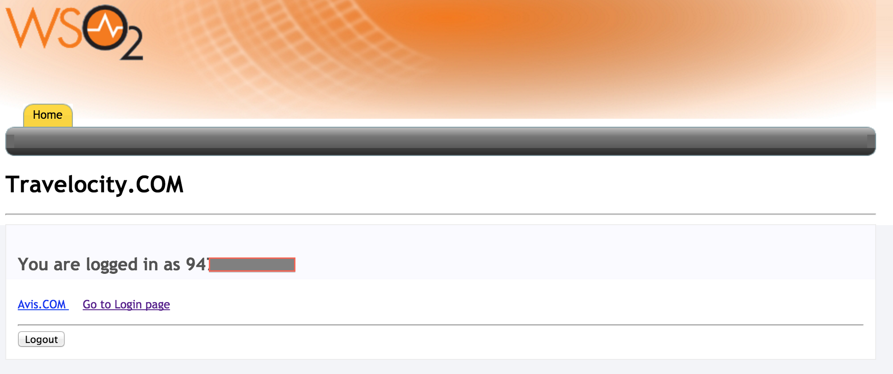
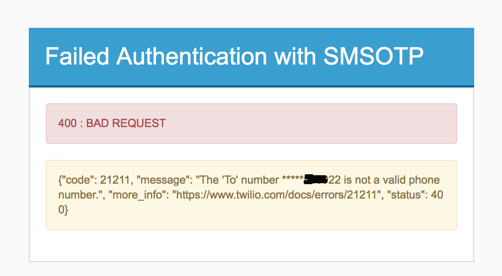

# Configuring Multi-factor Authentication using SMSOTP

This topic provides instructions on how to configure the SMSOTP connector and the WSO2 Identity Server to integrate using a sample app. This is configured so that SMSOTP is a second authentication factor for the sample application. See the following sections for more information.


>> To know more about the WSO2 Identity Server versions supported by this connector, see the [WSO2 Store](https://store.wso2.com/store/assets/isconnector/details/ec6a18ae-4763-4958-bc61-8e12f5b441ac).

>> This connector is supported by default from WSO2 Identity Server 5.3.0 onwards. For more information, see [Configuring SMS OTP](https://docs.wso2.com/display/IS550/Configuring+SMS+OTP).

* [Deploying SMSOTP artifacts](#deploying-smsotp-artifacts)
* [Deploying travelocity.com sample](#deploying-travelocity.com-sample)
* [Configuring the identity provider](#configuring-the-identity-provider)
* [Configuring the service provider](#configuring-the-service-provider)
* [Configuring claims](#configuring-claims)
* [Testing the sample](#testing-the-sample)

````
Note: If you have a older version, upgrade the connector and artifacts to the latest version from the connector store.
````
### Deploying SMSOTP artifacts

The artifacts can be obtained from [the store for this authenticator](https://store.wso2.com/store/assets/isconnector/list?q=%22_default%22%3A%22smsotp%22).
1. Place the smsotpauthenticationendpoint.war file into the <IS_HOME>/repository/deployment/server/webapps directory.
2. Place the org.wso2.carbon.extension.identity.authenticator.smsotp.connector-2.0.13.jar file into the <IS_HOME>/repository/components/dropins directory.<br/>
    
    ---
    **NOTE :**
       If you want to upgrade the SMSOTP Authenticator in your existing IS pack, please refer [upgrade instructions](https://docs.wso2.com/display/ISCONNECTORS/Authenticator+Upgrade+Instructions).
    
    ---

3. Add the following configurations in the <IS_HOME>/repository/conf/identity/application-authentication.xml file under the <AuthenticatorConfigs> section.<br/>
    ```` 
    <AuthenticatorConfig name="SMSOTP" enabled="true">
        <Parameter name="SMSOTPAuthenticationEndpointURL">https://localhost:9443/smsotpauthenticationendpoint/smsotp.jsp</Parameter>
        <Parameter name="SMSOTPAuthenticationEndpointErrorPage">https://localhost:9443/smsotpauthenticationendpoint/smsotpError.jsp</Parameter>
        <Parameter name="MobileNumberRegPage">https://localhost:9443/smsotpauthenticationendpoint/mobile.jsp</Parameter>
        <Parameter name="RetryEnable">true</Parameter>
        <Parameter name="ResendEnable">true</Parameter>
        <Parameter name="BackupCode">true</Parameter>
        <Parameter name="SMSOTPEnableByUserClaim">false</Parameter>
        <Parameter name="SMSOTPMandatory">false</Parameter>
        <Parameter name="usecase">association</Parameter>
        <Parameter name="secondaryUserstore">primary</Parameter>
        <Parameter name="CaptureAndUpdateMobileNumber">true</Parameter>
        <Parameter name="SendOTPDirectlyToMobile">false</Parameter>
        <Parameter name="EnableAlphanumericToken">true</Parameter>
        <Parameter name="TokenExpiryTime">30</Parameter>
        <Parameter name="TokenLength">8</Parameter>
        <Parameter name="SendOtpToFederatedMobile">true</Parameter>
        <Parameter name="federatedMobileAttributeKey">mobile</Parameter>
    </AuthenticatorConfig>
    ````
   The following table includes the definition of the parameters and the various values you can configure.
   
   | Value        | Description |
   | ------------- |-------------|
   | SMSOTPMandatory    |  If the value is true, the second step will be enabled by the admin. The user cannot be authenticated without SMS OTP authentication. This parameter is used for both super tenant and tenant in the configuration. The value can be true or false. |
   | screenUserAttribute    |  If you need to show n digits of mobile number or any other user attribute value in UI, This parameter will be used to pick the claim URI. |
   | CaptureAndUpdateMobileNumber    | In SMSOTPMandatory case, If user forgets to update the mobile number in specific user's profile and this property is true, then user can update a mobile claim with value in authentication time (If it is first login) and get the mobile number from user's profile to send OTP. This update functionality will happen in the first login only. Once user updates the mobile number, for the next login mobile number will be taken the updated mobile number from specific user's profile. |                                       
   | SendOTPDirectlyToMobile    | In SMSOTPMandatory case, If user does not exist in user store and If admin enable"SendOTPDirectlyToMobile" as true, then the user can enter the mobile number in authentication time in a mobile number request page and the OTP will directly send to that mobile number. |
   | BackupCode    | The backup code is used instead of the actual SMS code. The value can be true or false. If you do not want backup codes, set this as false. You can skip the steps 6.b and 7 in the [Configuring claims](https://docs.wso2.com/display/ISCONNECTORS/Configuring+Multi-factor+Authentication+using+SMSOTP#ConfiguringMulti-factorAuthenticationusingSMSOTP-Configuringclaims) section. |
   | noOfDigits    | The number of digits of claim value to show in UI. That is,if the mobile claim selected for the property "screenUserAttribute" and if the noOfDigits property has the value 4, then we can show the mobile number according to the property "order". If the order is backward, then we can show the last 4 digits of mobile claim in the UI. |
   | order    | The order whether first or last number of n digits. The possible value for this property is backward or forward. |
   | secondaryUserstore    | The user store configuration is maintained per tenant as comma separated values. For example, <Parameter name="secondaryUserstore">jdbc, abc, xyz</Parameter>. |
   | usecase    | This field can take one of the following values: local, association, userAttribute, subjectUri. If you do not specify any usecase, the default value is local. See below for more details. |
   | SMSOTPEnableByUserClaim    | This field makes it possible to disable the 'SMS OTP disabling byuser' functionality. The value can be true or false. If the value is true, the user can enable and disable the SMS OTP according to what the admin selects (SMSOTPMandatory parameter value). If this property is false, then you can skip the steps 6.a and 7 in the [Configuring claims](https://docs.wso2.com/display/ISCONNECTORS/Configuring+Multi-factor+Authentication+using+SMSOTP#ConfiguringMulti-factorAuthenticationusingSMSOTP-Configuringclaims) section |
   | ResendEnable    | This parameter makes it possible to resend the code in the same page if user applies the wrong code. This value can be true or false. |
   | EnableAlphanumericToken    | If the value is true, the generated token will be a alphanumeric value. Else it will generate a numeric token.  |
   | TokenExpiryTime    | This parameter makes it possible to set the expiry time of the OTP token. |
   | TokenLength    | This parameter makes it possible to set the length of the OTP token. |
   | SendOtpToFederatedMobile    | This parameter makes it possible to send the otp to the federated mobile claim when the user is not in active directory.|
   | federatedMobileAttributeKey    | This parameter identifies the mobile claim of the federated authenticator. Set this parameter if the SendOtpToFederatedMobile is set to true. |

   An admin can change the priority of the SMSOTP authenticator by changing the  SMSOTPMandatory value (true or false). 
   
        * If Admin specify that SMSOTP is mandatory ( <Parameter name="SMSOTPMandatory">true</Parameter> ) , then you must enable SMSOTP in the user’s profile by adding claim value true in order to authenticate the user. If this is not done, the SMSOTP error page appears.
        * If  Admin specify that SMSOTP is optional ( <Parameter name="SMSOTPMandatory">false</Parameter> ) and you enable SMSOTP in the user's profile, then the authenticator will allow the user to login with SMSOTP authentication as a second step (multi-step authentication). If Admin specifies that SMSOTP is optional and you do not enable SMSOTP in the user's profile, the SMSOTP authenticator will proceed to log the user in as the first step (basic authentication).  
   The first step may be local authenticator (basic) or a federated authenticator (e.g., Facebook, Twitter, etc.) . In federated authenticator support in first step, the following parameters are used according to the scenario.  
   
   ````
    <Parameter name="usecase">association</Parameter>
    <Parameter name="secondaryUserstore">jdbc</Parameter>
   ````
   The usecase value can be local, association, userAttribute or subjectUri.
   
   |         |  |
   | ------------- |-------------|
   | **local**    |  This is based on the federated username. This is the default. You must set the federated username in the localuserstore. Basically, the federated username must be the same as the local username. |
   | **association**    |  The federated username must be associated with the local account in advance in the Dashboard. So the local username is retrieved from the association. To associate the user, log into the end user dashboard and go to **Associated Account** by **clicking View details**. |
   | **userAttribute**    | The name of the  federatedauthenticator's user attribute. That is,the local user namewhich is contained in a federated user's attribute. When using this, add the following parameter under the <AuthenticatorConfig name="SMSOTP" enabled="true"> section in the <IS_HOME>/repository/conf/identity/application-authentication.xml file and put the value (e.g., email, screen_name, id, etc.). <br/>```` <Parameter name="userAttribute">email</Parameter> ```` <br/> If you use, OpenID Connect supported authenticators such as LinkedIn, Foursquare, etc., or in the case of multiple social login options as the first step and SMSOTP as secondstep , you need to add similar configuration for the specific authenticator in the <IS_HOME>/repository/conf/identity/application-authentication.xml file under the <AuthenticatorConfigs> section as follows (the following shows the configuration forFoursquare,LinkedIn and Facebook authenticator respectively).Inside the AuthenticatorConfig (i.e., Foursquare), add the specific userAttribute with a prefix of the (current step) authenticator name (i.e., SMSOTP-userAttribute).<br/> <br/> ```` <AuthenticatorConfig name="Foursquare" enabled="true"><Parameter name="SMSOTP-userAttribute">http://wso2.org/foursquare/claims/email</Parameter></AuthenticatorConfig> ```` <br/> <br/>```` <AuthenticatorConfig name="LinkedIn" enabled="true"> <Parameter name="SMSOTP-userAttribute">http://wso2.org/linkedin/claims/emailAddress</Parameter> </AuthenticatorConfig> ```` <br/> <br/>```` <AuthenticatorConfig name="FacebookAuthenticator" enabled="true"> <Parameter name="SMSOTP-userAttribute">email</Parameter> </AuthenticatorConfig> ```` <br/> <br/>  Likewise, you can add the AuthenticatorConfig forAmazon,Google,Twitterand Instagram with relevant values.|
   | **subjectUri**    | When configuring the federated authenticator, select the attribute in the subject identifier under the service provider section in UI, this is used as the username of the SMSOTP authenticator. |
     
   If you use the secondary userstore, enter all the userstore values for the particular tenant as comma separated values. 
   
   ````
   The user store configuration is maintained per tenant:
   *  If you use a super tenant, put all the parameter values into the <IS_HOME>/repository/conf/identity/application-authentication.xml file under the AuthenticatorConfigs section.
   *  If you use a tenant, upload the same XML file (application-authentication.xml) into a specific registry location (/_system/governance/SMSOTP). Create the collection named SMSOTP, add the resource and upload the application-authentication.xml file into theregistry). While doing the authentication, first it checks whether there is an XML file uploaded to the registry. If that is so, it reads it from the registry but does not take the local file. If there is no file in the registry, then it only takes the property values from the local file. This is how theuserstore configuration is maintained per tenant. You can use the registry or local file to get the property values.
   ```` 
   If you need to show last n digits of mobile number or any other user attribute value in UI,  the following parameters can be used  according to the scenario. For example, we can use the following parameters to get last 4 digits from mobile number.  
   ````
   <Parameter name="screenUserAttribute">http://wso2.org/claims/mobile</Parameter>
   <Parameter name="noOfDigits">4</Parameter>
   <Parameter name="order">backward</Parameter>
   ````
   The SMS provider is the entity that is used to send the SMS. The SMSOTP connector has been configured such that it can be used with most types of SMS APIs. Some use the GET method with the client secret and API Key encoded in the URL (e.g., Nexmo), while some may use the POST method when sending the values in the headers and the message and telephone number in the payload (e.g., Clickatell). Note that this could change significantly between different SMS providers. The configuration of the connector in the identity provider would also change based on this.
   
### Deploying travelocity.com sample
   
   The next step is to [deploy the sample app](deploying_the_sample_app.md) in order to use it in this scenario.
   
   Once this is done, the next step is to configure the WSO2 Identity Server by adding an [identity provider](https://docs.wso2.com/display/IS510/Configuring+an+Identity+Provider) and a [service provider](https://docs.wso2.com/display/IS510/Configuring+a+Service+Provider).
   
### Configuring the identity provider

Now you have to configure WSO2 Identity Server by [adding a new identity provider](https://docs.wso2.com/display/IS510/Configuring+an+Identity+Provider).

1. Download the WSO2 Identity Server from [here](http://wso2.com/products/identity-server/) and [run it](https://docs.wso2.com/display/IS510/Running+the+Product).
2. Download the certificate of the SMS provider. Go to the link (eg:- https://www.nexmo.com) in your browser, and then click the HTTPS trust icon on the address bar (e.g., the padlock next to the URL in Chrome)
3. Import that certificate into the IS client keystore.   
   keytool -importcert -file <certificate file> -keystore <IS>/repository/resources/security/client-truststore.jks -alias "Nexmo" <br/>
   ````
   Default client-truststore.jks password is "wso2carbon"
   ````
4. Log into the management console as an administrator.
5. In the **Identity** section under the **Main** tab of the [management console](https://docs.wso2.com/display/IS510/Getting+Started+with+the+Management+Console), click **Add** under **Identity Providers**.
6. Give a suitable name (e.g., SMSOTP) as the **Identity Provider Name**.
7. Go to the **SMSOTP Configuration** under **Federated Authenticators**.
8. Select both checkboxes to **Enable SMSOTP Authenticator** and make it the **Default**.
9. Enter the SMS URL and the HTTP Method used (e.g., GET or POST). Include the headers and payload if the API uses any. If the text message and the phone number are passed as parameters in any field, then include them as $ctx.num and $ctx.msg respectively. You must also enter the HTTP Response Code the SMS service provider sends when the API is successfully called. Nexmo API and  Bulksms API send 200 as the code, while Clickatell and Plivo send 202. If this value is unknown, leave it blank and the connector checks if the response is 200, 201 or 202. 
      - If you need to enable displaying detailed error messages coming from the SMS provider in the front end, set the value of **Show Detailed Error Information** to **true**. Additionally, if you need to prevent any sensitive values coming in the detailed error messages getting displayed in the UI, then mention them as comma separated values in the **Mask values in Error Info** field.
    
   **Note** : If Nexmo is used as the SMS provider,
   * Go to [https://dashboard.nexmo.com/sign-up](https://dashboard.nexmo.com/sign-up) and click free signup and register.
   * Under **API Settings** in **Settings**, copy and save the API key and Secret.
   * The Nexmo API requires the parameters to be encoded in the URL, so the SMS URL would be as follows.
   
     |         |  |
     | ------------- |-------------|
     | **SMS URL**    |  https://rest.nexmo.com/sms/json?api_key=####&api_secret=#####&from=NEXMO&to= $ctx.num &text= $ctx.msg   |
     | **HTTP Method**    |  GET |
   
   **Note** : If Clickatell is used as the SMS provider,
   * Go to [https://secure.clickatell.com/#/login](https://secure.clickatell.com/#/login) and create an account.
   * The auth token is provided when you register with Clickatell.
   * Clickatell uses a POST method with headers and the text message and phone number are sent as the payload. So the fields would be as follows.
   
     |         |  |
     | ------------- |-------------|
     | **SMS URL**    |  https://api.clickatell.com/rest/message   |
     | **HTTP Method**    |  POST |
     | **HTTP Headers**   |  X-Version: 1,Authorization: bearer ####,Accept: application/json,Content-Type: application/json   |
     | **HTTP Payload**   |  {"text":" $ctx.msg ","to":[" $ctx.num "]} | 
   
   **Note** : If Plivo is used as the SMS provider,  
   * Sign up for a free [Plivo trial account](https://manage.plivo.com/accounts/register/?utm_source=send%bulk%20sms&utm_medium=sms-docs&utm_campaign=internal).
   * Phone numbers must be verified at the [Sandbox Numbers](https://manage.plivo.com/sandbox-numbers/) page (add at least two numbers and verify them).
   * The Plivo API is authenticated with Basic Auth using your AUTH ID and AUTH TOKEN, Your Plivo AUTH ID and AUTH TOKEN can be found when you log in to your [dashboard](https://manage.plivo.com/dashboard/).
   * Plivo uses a POST method with headers, and the text message and phone number are sent as the payload. So the fields would be as follows.
   
     |         |  |
     | ------------- |-------------|
     | **SMS URL**    |  https://api.plivo.com/v1/Account/{auth_id}/Message/   |
     | **HTTP Method**    |  POST |
     | **HTTP Headers**   |  Authorization: Basic ####, Content-Type: application/json   |
     | **HTTP Payload**   |  {"src":"+94#######","dst":"$ctx.num","text":"$ctx.msg"} |

   **Note** : If Bulksms is used as the SMS provider,
   * Go to [https://www2.bulksms.com/login.mc](https://www2.bulksms.com/login.mc) and create an account.
   * While registering the account, verify your mobile number and click Claim to get free credits. 

     

   * Bulksms API authentication is performed by providing username and password request parameters.
   * Bulksms uses a POST method and the required parameters are to be encoded in the URL. So the fields would be as follows.

     |         |  |
     | ------------- |-------------|
     | **SMS URL**    |  https://bulksms.vsms.net/eapi/submission/send_sms/2/2.0?username=#######&password=#####&message=$ctx.msg&msisdn=$ctx.num  |
     | **HTTP Method**    |  POST |
     | **HTTP Headers**   |  Content-Type: application/x-www-form-urlencoded   |
   
   **Note** : If Twilio is used as the SMS provider,
   * Go to [https://www.twilio.com/try-twilio](https://www.twilio.com/try-twilio) and create an account.
   * While registering the account, verify your mobile number and click on console home [https://www.twilio.com/console](https://www.twilio.com/console) to get free credits (Account SID and Auth Token) .
   * Twilio uses a POST method with headers and the text message and phone number are sent as the payload. So the fields would be as follows. 
   
     |         |  |
     | ------------- |-------------|
     | **SMS URL**    |  https://api.twilio.com/2010-04-01/Accounts/{AccountSID}/SMS/Messages.json   |
     | **HTTP Method**    |  POST |
     | **HTTP Headers**   |  Authorization: Basic base64{AccountSID:AuthToken}   |
     | **HTTP Payload**   |  Body=$ctx.msg&To=$ctx.num&From={FROM_NUM} |
   
10. Click **Update** and you have now added and configured the Identity provider.


### Configuring the service provider

1. Return to the management console.
2. In the **Identity** section under the **Main** tab, click **Add** under **Service Providers**.
3. Enter travelocity.com in the **Service Provider Name** text box and click **Register**.
4. In the **Inbound Authentication** Configuration section, click **Configure** under the **SAML2 Web SSO Configuration** section.

   

5. Now set the configuration as follows:
   * **Issuer**: travelocity.com
   * **Assertion Consumer URL**: http://localhost:8080/travelocity.com/home.jsp
6. Select the following check-boxes:
   * **Enable Response Signing**
   * **Enable Single Logout**
   * **Enable Attribute Profile**
   * **Include Attributes in the Response Always**
7. Click **Update** to save the changes. Now you will be sent back to the Service Providers page.
8. Go to **Claim configuration** and select the mobile claim.

   

9. Go to **Local and Outbound Authentication Configuration** section.
10. Select the **Advanced configuration** radio button option.
11. Add the **basic** authentication as first step and **SMSOTP** authentication as a second step. Adding basic authentication as a first step ensures that the first step of authentication will be done using the user's credentials that are configured with the WSO2 Identity Server. SMSOTP is a second step that adds another layer of authentication and security.

    

12. Alternatively, federated authentication as the first step and SMSOTP authentication as the second step and click **Update** to save the changes.
    
### Configuring claims

1. Select **List** under **Users and Roles** in the IS Management Console.
2. Go to the **User Profile** and update the mobile number (This number must be registered with Nexmo, if you are using Nexmo API in order to send SMS).
   
   


   **Note**: If you wish to use the backup codes to authenticate, you need to add the following claim mentioned in **Step 7**, otherwise you can leave it.
3. In the **Main** menu, click **Add** under **Claims**.
4. Click [Add New Claim](https://docs.wso2.com/display/IS510/Adding+New+Claim+Mapping).
5. Select the **Dialect** from the dropdown provided and enter the required information.
6. Add the following user claims under 'http://wso2.org/claims'.

   a. Add the claim Uri - http://wso2.org/claims/identity/smsotp_disabled. This is an optional claim for SMSOTP.
   
     

   b. Add the claim Uri -  http://wso2.org/claims/otpbackupcodes
     The backup code claim is an optional.
     
     

7. Go to Users → admin →User Profile and update the Backup codes and user can disable SMS OTP by clicking "Disable SMS OTP".

   

### Testing the sample

1. To test the sample, go to the following URL: http://localhost:8080/travelocity.com

   
   
2. Click the link to log in with SAML from WSO2 Identity Server.
3. The basic authentication page will be visible. Use your WSO2 Identity Server credentials to sign in.
   
   

4. You will get a token to your mobile phone.Type the code to authenticate, You will be taken to the home page of the travelocity.com app
   
   
   <br/>
   <br/>
   

5. If you enable **Show Detailed Error Information** in the SMS authenticator configurations, you will see the 
detailed error message provided by the SMS provider as below.
   <br/>
   
 
 ````
 Note : In case, If you forget the mobile phone number or do not have access to it, you can use the backup codes to authenticate and  you will be taken to the home page of the travelocity.com application.
 ````
